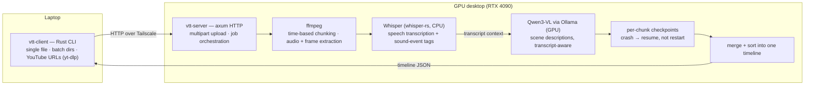

# vid-to-text

Turn a video into a structured, timestamped account of everything in it — speech, visuals, and sound events — using **local models on your own hardware**. A Rust client/server pair: the CLI runs on a laptop, the server runs on a GPU desktop, and a video comes back as a merged JSON timeline of `speech` / `visual` / `sound` segments. Nothing leaves your machines unless you opt into the LLM formatting step.

## Architecture



Every chunk flows through Whisper first so the vision model sees the transcript for context; results checkpoint per chunk so a crashed job resumes where it stopped.

## Output

```json
{
  "source": "standup-2026-06-12.mp4",
  "duration_seconds": 1043.2,
  "segments": [
    { "type": "speech", "start": "00:00:04.120", "end": "00:00:09.480",
      "content": "Alright, quick status on the billing migration." },
    { "type": "visual", "start": "00:00:00.000", "end": "00:00:30.000",
      "content": "Screen share of a kanban board; three columns, five cards visible." },
    { "type": "sound",  "start": "00:03:11.200", "end": "00:03:12.900",
      "content": "[door closing]" }
  ]
}
```

An optional `format` command turns the raw timeline into a readable document via an OpenAI model — chunked at a 25K-token budget with scene grouping carried across continuations. This is the only network-dependent stage, and it's off the critical path.

## Component map

| Path | Responsibility |
|---|---|
| `vtt-client/` | CLI: config, uploads, batch directory processing, output writing |
| `vtt-server/` | axum server: multipart intake, job lifecycle, pipeline dispatch |
| `vtt-core/pipeline.rs` | Orchestration: chunk → transcribe → describe → checkpoint → merge |
| `vtt-core/ffmpeg.rs` | Chunking, audio extraction, frame sampling (configurable fps) |
| `vtt-core/whisper.rs` | whisper-rs integration; speech + non-speech sound tagging |
| `vtt-core/vision.rs` | Ollama/Qwen3-VL calls; thinking-tag stripping, repetition guards |
| `vtt-core/checkpoint.rs` | Per-chunk persistence and resume |
| `vtt-core/ytdlp.rs` | YouTube URL ingestion via yt-dlp |
| `vtt-core/config.rs` | Layered TOML config for both binaries |
| `prompts/` | Vision and formatting prompt templates (editable, not hardcoded) |
| `docs/`, `prs/`, `memory/` | Architecture SSOT, research-gated PR files, workflow memory |

## Running it

```bash
# Desktop (server) — needs ffmpeg, a Whisper GGML model, and Ollama with a vision model
cargo run --release -p vtt-server

# Laptop (client)
cargo run --release -p vtt-client -- process video.mp4
cargo run --release -p vtt-client -- process ./videos/          # batch
cargo run --release -p vtt-client -- process "https://youtube.com/watch?v=..."
cargo run --release -p vtt-client -- format video.json         # optional, needs OPENAI_API_KEY
```

Both binaries read layered TOML config (paths, models, chunk sizes, frame fps, endpoints — nothing is hardcoded).

## Testing

154 tests across the workspace (13 ignored — they need ffmpeg, a Whisper model, or a live Ollama):

```bash
cargo test
```

## Honest scope

- Built for a two-machine personal setup (laptop + one GPU desktop over Tailscale); the server trusts its network, so put it behind a VPN, not the internet.
- mp4-first; other containers work only as far as ffmpeg carries them.
- Sound-event tagging is Whisper's non-speech token output — useful, not a dedicated audio-events model.
- The vision stage's quality tracks whatever Ollama model you point it at; prompts are tuned for Qwen3-VL-8B-Thinking (including stripping its thinking tags).

## License

MIT
